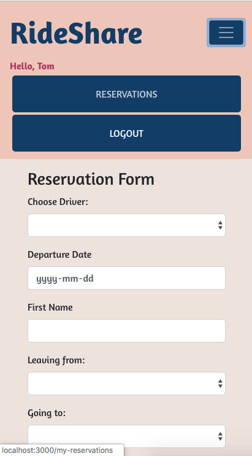
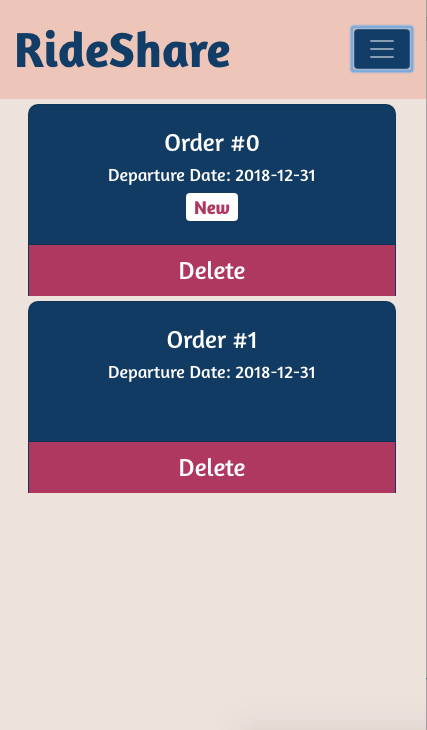
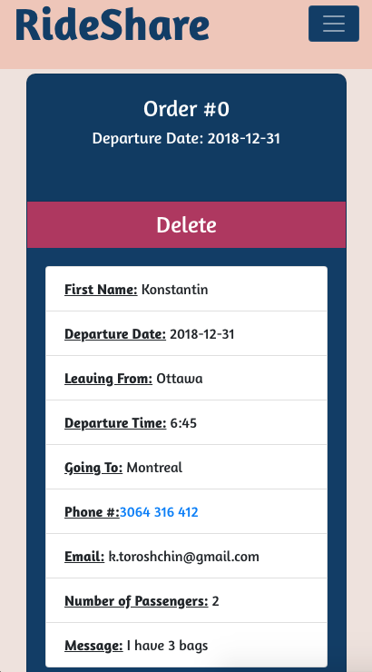

# RideShare(in development)

A user-friendly full stack web application based on create-react-app for people who like Cheap RideShare Services to travel from A to B.
App helps people submit reservation and provide a friendly interface for drivers to manage orders.

##Technical Specifications
Stack:
* Front-end: JSX, ES6, REACT, BOOTSTRAP, REACTSTRAP, AXIOS
* Back-end: EXPRESS, KNEX, postgreSQL, nodemon(for development)

### Homepage(mobile version)

### Screenshot drivers list of orders(mobile version)

### Screenshot order details(mobile version)

